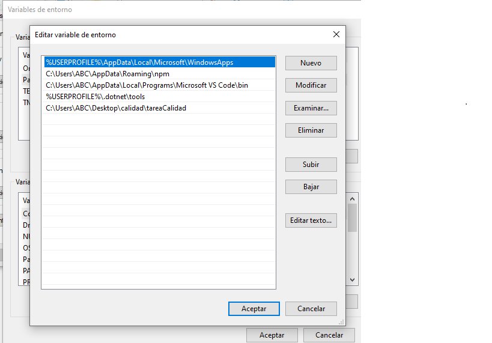

 

# Automatizacion de la pagina yahoo con selenium WebDriver.
#
# instalar driver selenium 

1. selenium-webdriver
 [selenium]: https://www.selenium.dev/selenium/docs/api/javascript/index.html
2. Abrir simbolo del sistema 
3. ejecutar el comando "npm install selenium-webdriver"
# Descargar las dependencias 
1 chromedriver
2 geckodriver
# Guardar en una carpeta y configurar en variables de entorno.
   
# Crear el proyecto
  
# Subir el proyecto a repositorio de GitHub 
* git init
* git add .
* git commit -m "first commit"
* git remote add origin https://github.com/NOMBRE_USUARIO/NOMBRE_PROYECTO.git
* git push -u origin main